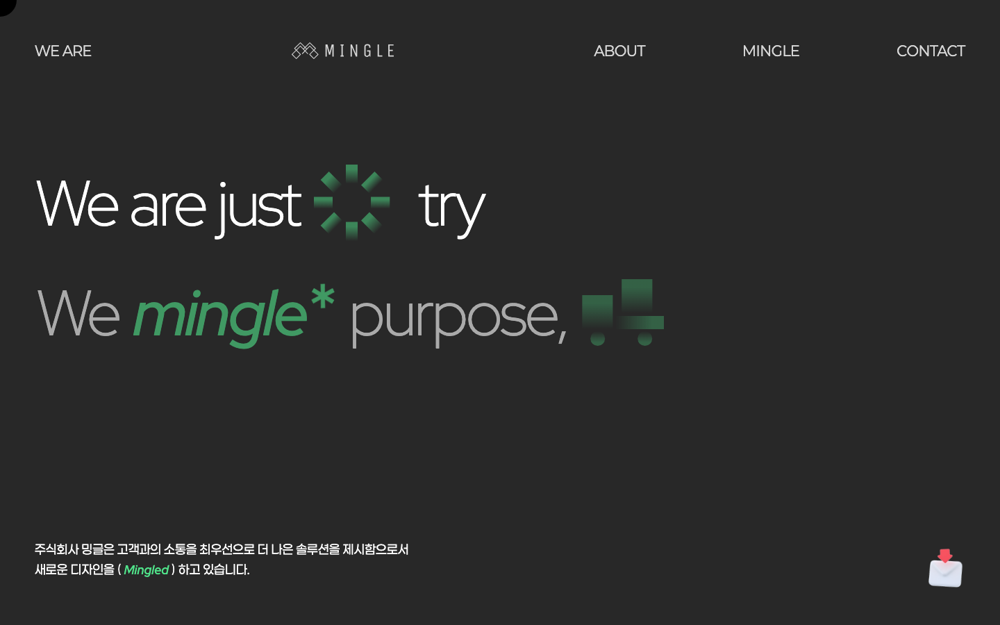
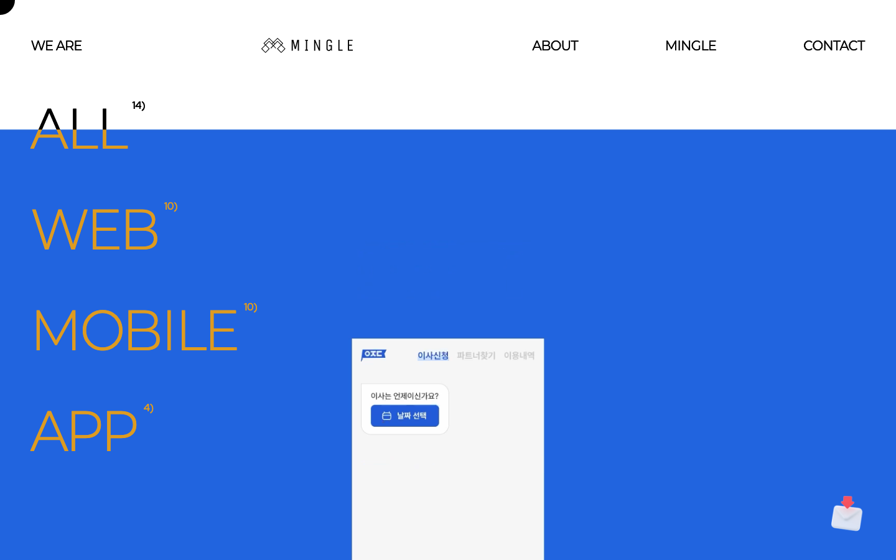
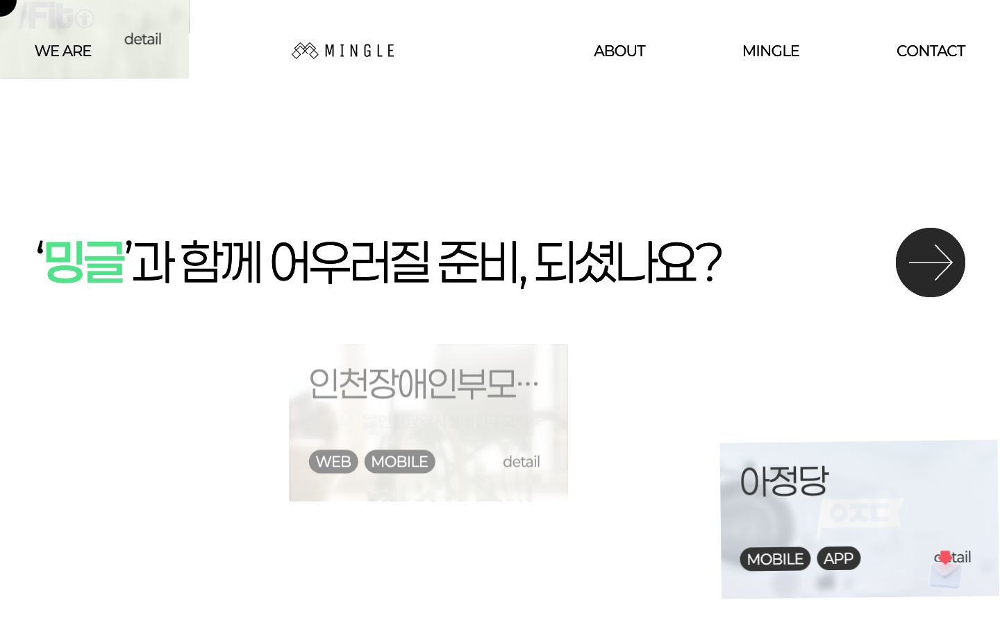
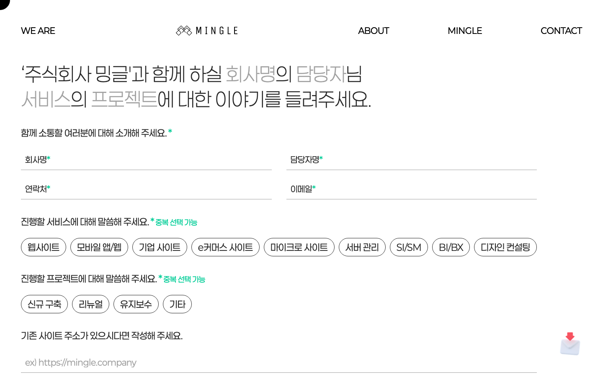
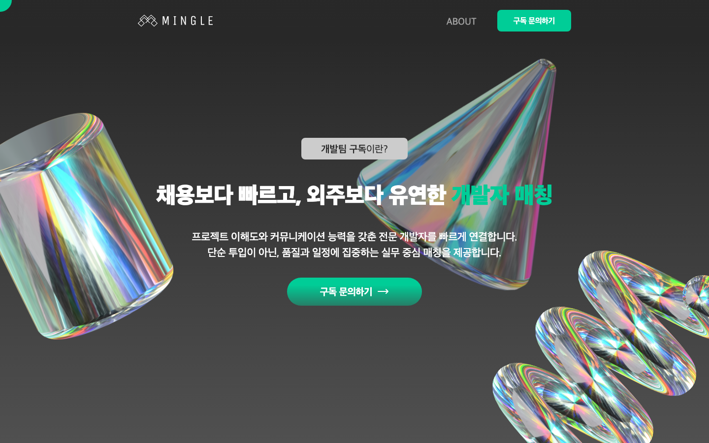
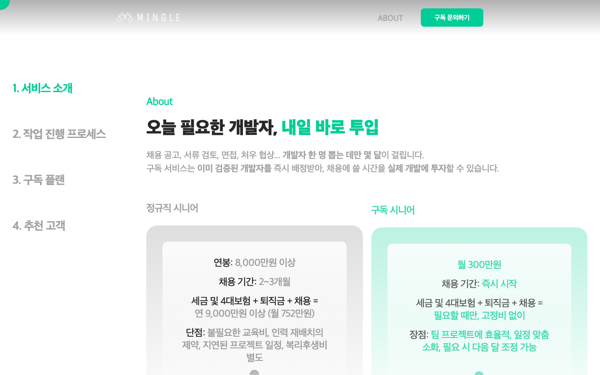
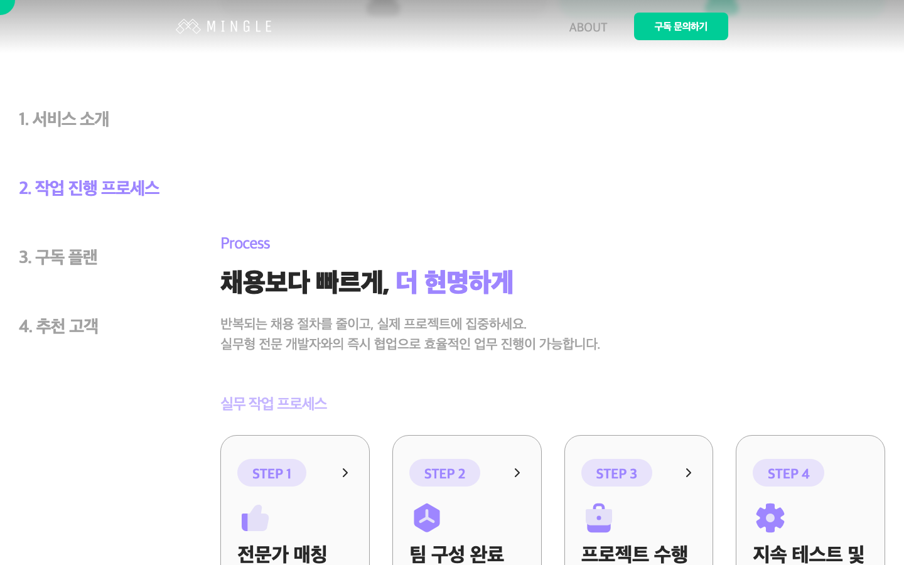
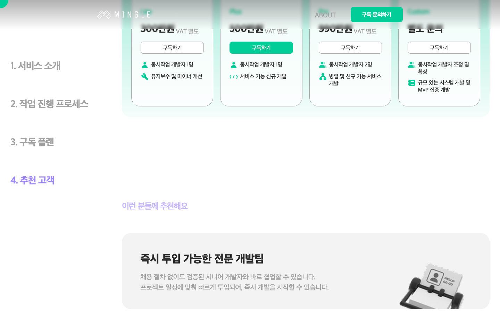

# 밍글 홈페이지

디지털 크리에이티브 에이전시 공식 웹사이트

| 항목 | 내용 |
|------|------|
| **개발 기간** | 2025.04 ~ 진행 중 |
| **역할** | 풀스택 단독 개발 (메인 웹사이트 + 구독 서비스 웹사이트) |
| **상태** | 운영 중 |
| **URL** | [mingle.company](https://mingle.company) / [sub.mingle.company](https://sub.mingle.company) |

## 📸 스크린샷

### 메인 웹사이트 (mingle.company)
| 히어로 | 포트폴리오 | 서비스 소개 | 상담 신청 |
|:---:|:---:|:---:|:---:|
|  |  |  |  |

### 구독 웹사이트 (sub.mingle.company)
| 히어로 | 서비스 소개 | 작업 프로세스 | 구독 플랜 |
|:---:|:---:|:---:|:---:|
|  |  |  |  |

## 🌐 프로젝트 개요

주식회사 밍글(MINGLE)의 공식 웹사이트입니다. "incredible, creative, fun"을 모토로 UI/UX 컨설팅 및 개발 서비스를 제공하는 디지털 크리에이티브 에이전시의 브랜드를 표현하는 웹사이트입니다.

## 🛠 기술 스택

### Frontend (공통)
- **Framework:** React 19, Vite 7
- **Routing:** React Router DOM v7
- **State Management:** Zustand
- **Animation:** Framer Motion
- **HTTP Client:** Axios
- **Styling:** CSS Modules

### 메인 웹사이트 (메인WEB)

#### 주요 라이브러리
```json
{
  "react": "^19.2.1",                          // React 19
  "react-router-dom": "^7.6.3",               // SPA 라우팅
  "zustand": "^5.0.6",                         // 전역 상태 관리
  "gsap": "^3.13.0",                           // 고급 애니메이션
  "@gsap/react": "^2.1.2",                    // GSAP React 통합
  "locomotive-scroll": "^4.1.4",               // 부드러운 스크롤
  "framer-motion": "^12.23.5",                // 페이지 전환 효과
  "react-creative-cursor": "^1.2.7",          // 커스텀 커서
  "lottie-react": "^2.4.1",                   // Lottie 애니메이션
  "matter-js": "^0.20.0",                      // 물리 엔진
  "swiper": "^11.2.10",                        // 슬라이더
  "react-type-animation": "^3.2.0",           // 타이핑 애니메이션
  "@toast-ui/editor": "^3.1.0",               // 마크다운 에디터
  "axios": "^1.10.0"                           // HTTP 요청
}
```

### 구독 웹사이트 (구독WEB)

#### 주요 라이브러리
```json
{
  "react": "^19.2.1",                          // React 19
  "react-router-dom": "^7.9.6",               // SPA 라우팅
  "zustand": "^5.0.8",                         // 전역 상태 관리
  "framer-motion": "^12.23.24",               // 페이지 전환 효과
  "@ssgoi/react": "^2.5.3",                   // View Transitions
  "react-creative-cursor": "^1.2.7",          // 커스텀 커서
  "lottie-react": "^2.4.1",                   // Lottie 애니메이션
  "swiper": "^12.0.3",                         // 슬라이더
  "react-type-animation": "^3.2.0",           // 타이핑 애니메이션
  "@toast-ui/editor": "^3.2.2",               // 마크다운 에디터
  "axios": "^1.13.2"                           // HTTP 요청
}
```

## ✨ 주요 기능

### 메인 웹사이트 (메인WEB)

#### 1. 홈페이지
- **히어로 섹션:** Matter.js 물리 엔진을 이용한 인터랙티브 로고 애니메이션
- **회사 소개:** GSAP ScrollTrigger를 이용한 스크롤 기반 콘텐츠 전환
- **서비스 소개:** 제공 서비스 소개 섹션
- **포트폴리오 쇼케이스:** Swiper를 이용한 주요 프로젝트 하이라이트

#### 2. 포트폴리오
- **프로젝트 갤러리:** 그리드 레이아웃의 작품 목록
- **상세 페이지:** 각 프로젝트의 상세 설명
- **썸네일 & 스크롤링:** Swiper 이미지 슬라이더 및 스크롤 효과
- **필터링:** 카테고리별 프로젝트 필터

#### 3. About
- **회사 비전:** 밍글의 철학과 방향성
- **팀 소개:** 구성원 소개
- **연혁:** 회사 성장 과정

#### 4. 인터랙티브 요소
- **커스텀 커서:** react-creative-cursor를 이용한 인터랙티브 커서
- **스크롤 애니메이션:** GSAP ScrollTrigger 기반 애니메이션
- **페이지 전환:** Framer Motion을 이용한 부드러운 페이지 전환 효과
- **반응형 디자인:** 모바일/태블릿/데스크톱 대응

### 구독 웹사이트 (구독WEB)

#### 1. 개발팀 구독 서비스
- **서비스 소개:** 개발팀 구독 모델 설명
- **요금제:** 구독 플랜 및 가격 정보
- **상담 신청:** 프로젝트 상담 폼

#### 2. 상담 신청 폼
- **프로젝트 정보:** 프로젝트명, 예산, 기간 입력
- **파일 첨부:** Axios를 이용한 기획서/디자인 파일 업로드
- **연락처 정보:** 담당자 정보 입력
- **문의 내용:** Toast UI Editor를 이용한 상세 문의 사항 작성

#### 3. About
- **구독 서비스 장점:** 구독 모델의 이점 설명
- **프로세스:** 진행 프로세스 소개
- **FAQ:** 자주 묻는 질문

## 📁 프로젝트 구조

```
밍글홈페이지/
├── 메인WEB/                 # 메인 웹사이트
│   ├── src/
│   │   ├── pages/          # 페이지 컴포넌트
│   │   │   ├── Home.jsx   # 메인 페이지
│   │   │   ├── About.jsx  # 회사 소개
│   │   │   ├── PortPolio.jsx  # 포트폴리오 목록
│   │   │   └── PortPolioView.jsx  # 포트폴리오 상세
│   │   ├── components/     # 재사용 컴포넌트
│   │   │   ├── Header.jsx # 헤더/네비게이션
│   │   │   ├── BlobCursor/ # 커스텀 커서
│   │   │   ├── Loading/   # 로딩 컴포넌트
│   │   │   └── Scrolling/ # 스크롤 효과
│   │   ├── store/         # Zustand 스토어
│   │   └── App.jsx        # 메인 앱
│   └── index.html
│
└── 구독WEB/                 # 구독 서비스 웹사이트
    ├── src/
    │   ├── pages/          # 페이지 컴포넌트
    │   │   ├── Home.jsx   # 메인 페이지
    │   │   ├── About.jsx  # 서비스 소개
    │   │   └── Counseling.jsx  # 상담 신청
    │   ├── components/     # 재사용 컴포넌트
    │   │   ├── Header.jsx # 헤더
    │   │   ├── Footer.jsx # 푸터
    │   │   └── Form.jsx   # 상담 신청 폼
    │   └── App.jsx
    └── index.html
```

## 🎨 디자인 특징

### 1. 인터랙티브 UI
- **Creative Cursor:** react-creative-cursor를 이용한 마우스를 따라다니는 커서
- **Scroll Animations:** GSAP ScrollTrigger를 이용한 스크롤에 반응하는 요소들
- **Physics:** Matter.js를 이용한 물리 엔진 기반 인터랙션

### 2. 애니메이션
- **GSAP:** ScrollTrigger를 이용한 스크롤 기반 타임라인 애니메이션
- **Framer Motion:** 페이지 전환 시 fade/slide 효과
- **Lottie:** lottie-react를 이용한 JSON 기반 애니메이션
- **Locomotive Scroll:** 부드러운 스크롤 경험

### 3. 반응형 디자인
- **Desktop:** 1920px 기준 최적화
- **Tablet:** 768px ~ 1024px 대응
- **Mobile:** 375px ~ 767px 대응
- **Fluid Typography:** viewport 기반 폰트 크기 조절


## 🌐 공식 웹사이트

- **메인:** [https://mingle.company](https://mingle.company)
- **구독:** [https://sub.mingle.company](https://sub.mingle.company)

## 🎯 주요 기술적 도전

1. **Matter.js 물리 엔진 인터랙션:** 히어로 섹션에 물리 엔진 기반 인터랙티브 로고 애니메이션 구현. 사용자의 마우스 움직임에 반응하는 물리 시뮬레이션
2. **GSAP ScrollTrigger 타임라인:** 스크롤 위치에 따라 정밀하게 제어되는 복합 애니메이션 시퀀스 설계
3. **Locomotive Scroll + GSAP 통합:** 부드러운 스크롤 라이브러리와 애니메이션 라이브러리의 스크롤 위치 동기화 처리
4. **반응형 인터랙션 설계:** 데스크톱의 커스텀 커서/호버 인터랙션을 모바일에서는 터치 기반으로 대체하는 적응형 UX

