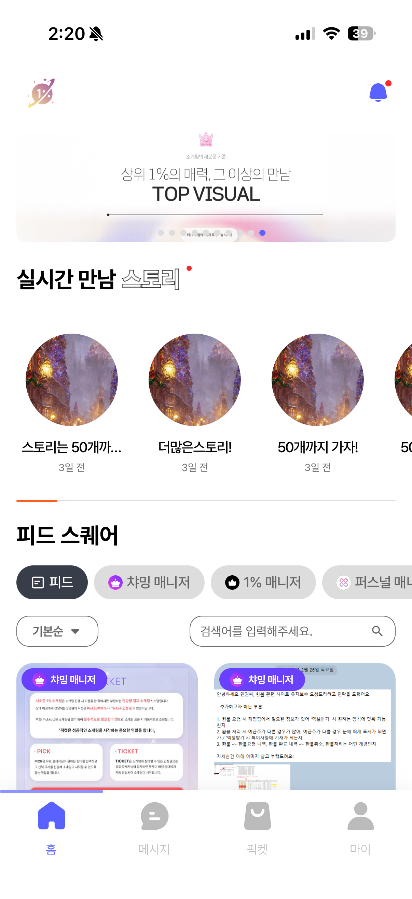
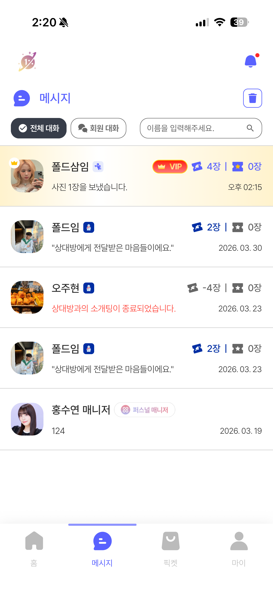
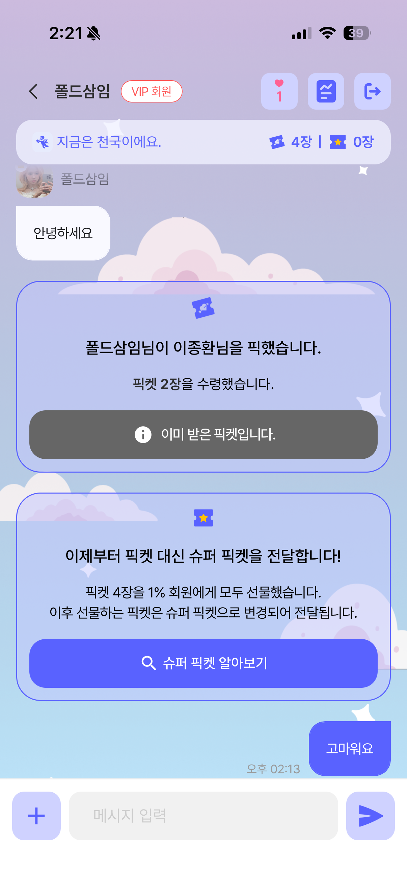
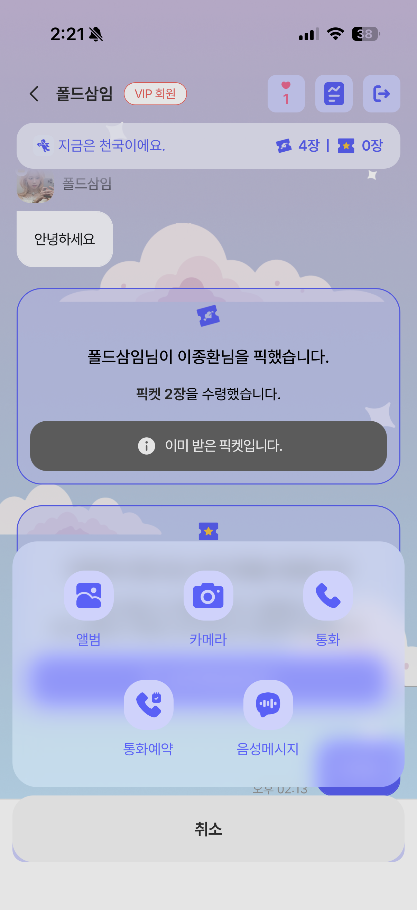
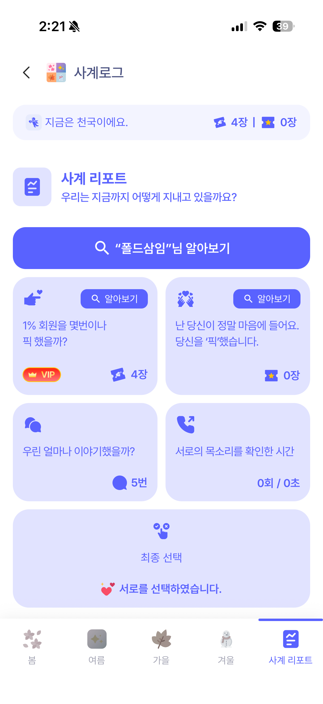

# 소개팅 앱

실시간 매칭 기반 소셜 데이팅 플랫폼

| 항목 | 내용 |
|------|------|
| **개발 기간** | 2026.01 ~ 진행 중 |
| **역할** | 풀스택 단독 개발 (기획, 프론트엔드, 백엔드, 배포) |
| **상태** | 개발 완료, 기능 추가 기획 중 |

## 📸 스크린샷

| 홈/매칭 | 메시지 | 채팅 | 통화/미디어 | 사계 리포트 |
|:---:|:---:|:---:|:---:|:---:|
|  |  |  |  |  |

## 📱 프로젝트 개요

사용자 간의 진지한 소개팅을 중심으로 한 소셜 데이팅 앱입니다. 픽켓 시스템, 음성 통화, 소개팅 일정에 따른 채팅방 테마 변경 등 차별화된 기능을 제공합니다.

## 🛠 기술 스택

### Frontend (APP)
- **Framework:** React Native 0.79, Expo 53
- **State Management:** Zustand
- **Real-time Communication:** Socket.io, Twilio Voice SDK
- **Authentication:** Firebase Auth, 소셜 로그인 (카카오, 네이버, Google, Apple)
- **Push Notification:** Firebase Cloud Messaging
- **UI/UX:** React Native Reanimated, Lottie

### Backend (비공개)
- **Runtime:** Node.js
- **Real-time:** Socket.io
- **Authentication:** JWT, Firebase Auth
- **Voice:** Twilio Voice SDK

### 주요 라이브러리
```json
{
  "socket.io-client": "^4.8.1",              // 실시간 채팅
  "voice-react-native-sdk": "twilio 기반",    // 음성 통화 (Twilio 네이티브 커스터마이징)
  "@react-native-firebase/messaging": "^23", // FCM 푸시 알림
  "@react-native-seoul/kakao-login": "^5",  // 카카오 로그인
  "@react-native-seoul/naver-login": "^4",  // 네이버 로그인
  "@react-native-google-signin": "^13",     // Google 로그인
  "@invertase/react-native-apple-authentication": "^2", // Apple 로그인
  "expo-router": "~5.1",                     // 파일 기반 라우팅
  "react-native-iap": "^14",                 // 인앱 결제
  "zustand": "^5.0.3"                        // 전역 상태 관리
}
```

## ✨ 주요 기능

### 1. 매칭 시스템
- **매니저 전담:** 1:1 매니저가 전담하여 상대방 추천
- **필터링:** 지역, 나이, MBTI 등 다양한 필터 옵션

### 2. 커뮤니케이션
- **실시간 채팅:** Socket.io 기반 1:1 채팅
- **음성 통화:** Twilio Voice SDK를 이용한 실시간 음성 통화
- **타임캡슐:** 특정 시간 후 열리는 메시지 전송
- **채팅 테마:** 소개팅 일정에 따른 채팅방 테마 자동 변경
- **채팅방 관리:** 픽켓 내역 확인, 차단, 신고 기능

### 3. 프로필 관리
- **프로필 커스터마이징:** 사진, 성향, 관심사 등 설정
- **매력 포인트:** 자신의 매력을 어필할 수 있는 항목 선택

### 4. 리매치 시스템
- **재매칭 요청:** 이전에 매칭되었던 상대에게 재매칭 요청
- **수락/거절:** 양방향 동의 시스템

### 5. 소셜 기능
- **스토리:** 오늘의 최종커플 소개 콘텐츠
- **피드:** 매니저들의 게시물 피드

### 6. 결제 & 구독
- **인앱 결제:** react-native-iap를 통한 iOS/Android 인앱 결제
- **유료 기능:** 상대방에게 어필 할 수 있는 픽켓 
- **환불 관리:** 결제 내역 및 환불 요청

## 📁 프로젝트 구조

```
APP/
├── app/                    # 화면 컴포넌트 (Expo Router)
│   ├── (tabs)/            # 탭 네비게이션 화면
│   ├── (season)/          # 시즌별 기능
│   ├── auth/              # 인증 관련 화면
│   ├── chat/              # 채팅 관련 화면
│   ├── call/              # 음성 통화
│   ├── profile/           # 프로필 관련 화면
│   ├── payment/           # 결제 관련 화면
│   └── _layout.jsx        # 레이아웃
├── components/            # 재사용 가능한 컴포넌트
│   ├── chat/             # 채팅 컴포넌트
│   └── popups/           # 팝업 컴포넌트
├── hooks/                 # Custom Hooks
│   ├── useTwilioVoice.js # Twilio 음성 통화 Hook
│   └── TwilioVoiceService.js # Twilio 서비스
└── locales/              # 다국어 리소스 (i18next)
```

## 🎯 주요 기술적 도전

1. **Twilio Voice SDK 네이티브 커스터마이징:** Twilio 공식 React Native SDK의 한계를 극복하기 위해 네이티브 모듈을 직접 수정하여 안정적인 음성 통화 구현
2. **Socket.io 실시간 채팅 아키텍처:** 연결 끊김 복구, 메시지 순서 보장, 오프라인 메시지 큐잉 등 실시간 통신의 엣지 케이스 처리
3. **4개 소셜 로그인 통합:** 카카오, 네이버, Google, Apple 각각의 인증 플로우 차이를 통합된 인터페이스로 처리
4. **iOS/Android 인앱 결제:** react-native-iap를 이용한 크로스 플랫폼 결제 및 구독 시스템 구현
5. **채팅방 테마 시스템:** 소개팅 진행 단계에 따라 채팅방 UI가 동적으로 변경되는 시스템 설계

> **서버 소스**는 보안상 비공개입니다. 필요시 요청해 주세요.

