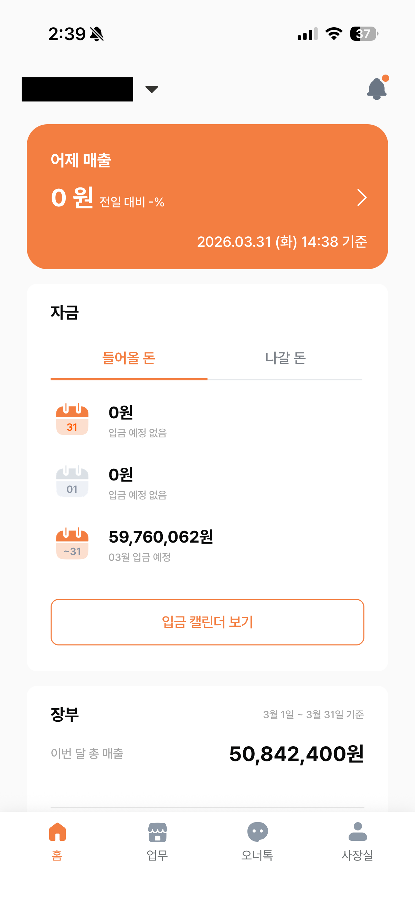
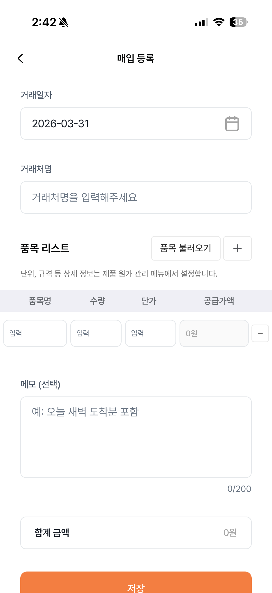
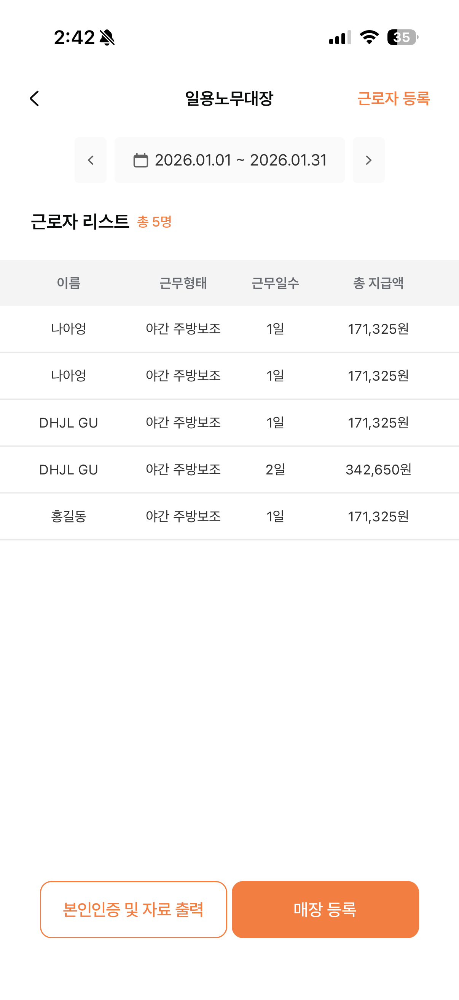
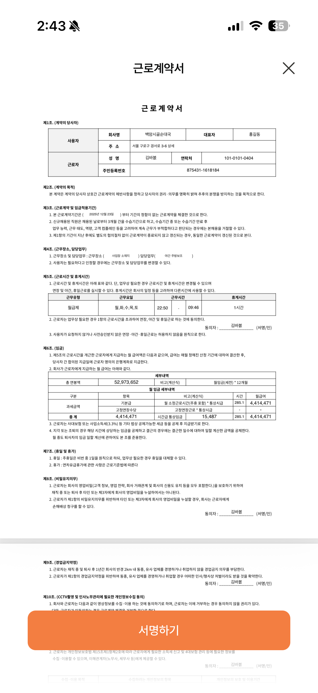
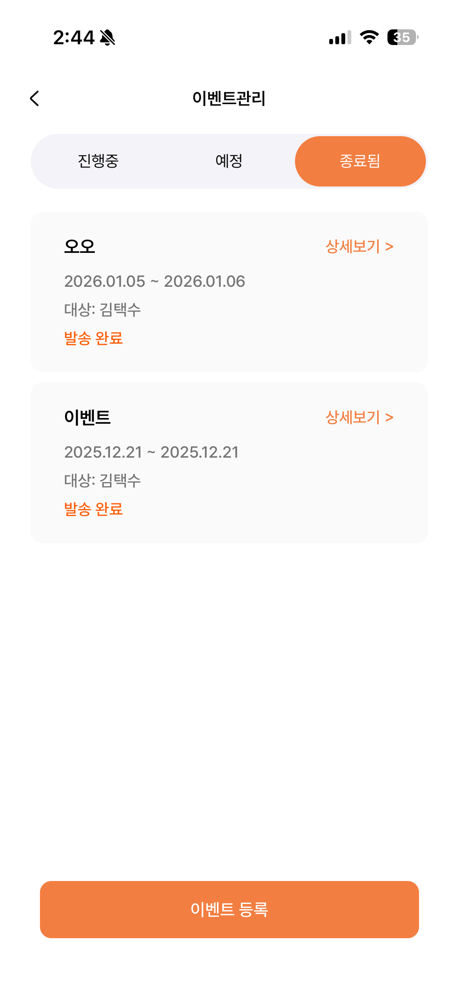
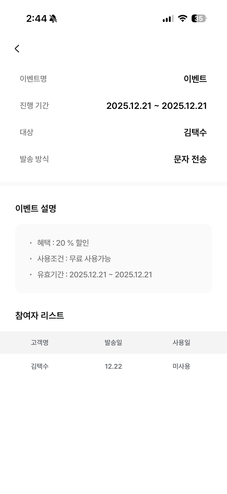

# 자영업자 매장관리 앱

자영업자를 위한 올인원 매장 관리 솔루션

| 항목 | 내용 |
|------|------|
| **개발 기간** | 2025.10 ~ 2026.02 |
| **역할** | 풀스택 단독 개발 (모바일 앱 + 백엔드 서버 + 관리자 웹) |
| **상태** | 개발 완료, 기능 추가 기획 중 |

## 📸 스크린샷

### 메인 / 업무 관리
| 홈 (매출 현황) | 업무 메뉴 | 영수증 OCR | 매입 등록 | 일용노무대장 |
|:---:|:---:|:---:|:---:|:---:|
|  |  |  |  |  |

### 직원 / 계약 / 고객 관리
| 근로자 등록 | 직원 관리 | 근로계약서 | 고객 관리 | 고객 등록 (매장) |
|:---:|:---:|:---:|:---:|:---:|
|  |  |  |  |  |

### 이벤트 / 커뮤니티 / 마이페이지
| 이벤트 관리 | 이벤트 상세 | 커뮤니티 (투표) | 커뮤니티 (댓글) | 마이페이지 |
|:---:|:---:|:---:|:---:|:---:|
|  |  |  |  |  |

### 등급 / 알림
| 등급 & 뱃지 | 알림 |
|:---:|:---:|
|  |  |

## 📱 프로젝트 개요

소상공인과 자영업자가 매장을 효율적으로 관리할 수 있도록 돕는 통합 관리 플랫폼입니다. 매출/매입 관리부터 직원 관리, 세무 처리까지 모든 업무를 하나의 앱에서 처리할 수 있습니다.

### 핵심 차별점
- **AI 영수증 인식:** OpenAI API를 활용하여 영수증 사진만으로 매입 데이터 자동 입력
- **세무 자동화:** 홈택스/카드사 API 연동으로 부가세 신고 자료 자동 생성
- **전자 계약:** 디지털 서명 기반 근로계약서 작성 및 PDF 보관
- **통합 대시보드:** 14개 업무 모듈을 하나의 앱에서 관리

## 🛠 기술 스택

### Frontend (APP)
- **Framework:** React Native 0.81, Expo 54
- **State Management:** Zustand
- **Navigation:** Expo Router
- **Authentication:** Firebase Auth, 소셜 로그인 (카카오, Google, Apple)
- **Charts:** React Native Gifted Charts
- **UI/UX:** React Native Reanimated, Lottie

### 주요 라이브러리
```json
{
  "@react-native-firebase/messaging": "^23",   // FCM 푸시 알림
  "@react-native-kakao/user": "^2.4.4",        // 카카오 로그인
  "@react-native-google-signin/google-signin": "^16", // Google 로그인
  "expo-apple-authentication": "~8.0",         // Apple 로그인
  "react-native-gifted-charts": "^1.4",        // 차트 시각화
  "react-native-calendars": "^1.1313.0",       // 캘린더
  "react-native-pdf": "^7.0.3",                // PDF 뷰어
  "react-native-pell-rich-editor": "^1.10.0",  // 리치 텍스트 에디터
  "react-native-signature-canvas": "^5.0.2",   // 전자 서명
  "xlsx": "^0.18.5",                           // 엑셀 파일 처리
  "zustand": "^5.0.8"                          // 전역 상태 관리
}
```

### Backend (SERVER)
- **Runtime:** Node.js, Express 5
- **Database:** PostgreSQL (Sequelize ORM)
- **Authentication:** JWT, bcrypt 암호화
- **File Storage:** AWS S3
- **AI/ML:** OpenAI API (영수증 OCR), Anthropic Claude API
- **Cloud Services:** AWS Secrets Manager

### 주요 라이브러리
```json
{
  "express": "^5.1.0",                         // 웹 서버
  "sequelize": "^6.37.7",                      // PostgreSQL ORM
  "pg": "^8.16.3",                             // PostgreSQL 드라이버
  "bcrypt": "^6.0.0",                          // 비밀번호 해싱
  "jsonwebtoken": "^9.0.2",                    // JWT 인증
  "@aws-sdk/client-s3": "^3.962.0",           // AWS S3 파일 업로드
  "@aws-sdk/client-secrets-manager": "^3.962.0", // AWS 비밀 관리
  "openai": "^6.18.0",                         // OpenAI API (OCR)
  "@anthropic-ai/sdk": "^0.71.2",             // Claude API
  "firebase-admin": "^13.6.0",                 // Firebase Admin SDK
  "node-cron": "^4.2.1",                       // 스케줄링 작업
  "nodemailer": "^7.0.9",                      // 이메일 발송
  "pdf-lib": "^1.17.1",                        // PDF 생성/수정
  "sharp": "^0.34.4",                          // 이미지 처리
  "helmet": "^8.1.0",                          // 보안 미들웨어
  "express-rate-limit": "^8.1.0"              // API Rate Limiting
}
```

### Admin (ADMIN)
- **Framework:** React 19, Vite 7
- **State Management:** Zustand
- **Router:** React Router DOM v7
- **Charts:** ECharts
- **UI/UX:** Framer Motion, React Toastify

### 주요 라이브러리
```json
{
  "react": "^19.1.0",                          // React 19
  "react-router-dom": "^7.6.3",               // SPA 라우팅
  "zustand": "^5.0.6",                         // 전역 상태 관리
  "echarts-for-react": "^3.0.5",              // 차트 라이브러리
  "axios": "^1.10.0",                          // HTTP 클라이언트
  "@dnd-kit/core": "^6.3.1",                  // 드래그앤드롭
  "@toast-ui/react-editor": "^3.2.3",         // WYSIWYG 에디터
  "react-datepicker": "^8.4.0",               // 날짜 선택
  "react-daum-postcode": "^3.2.0",            // 다음 우편번호
  "xlsx": "^0.18.5",                           // 엑셀 파일 처리
  "framer-motion": "^12.23.5"                  // 애니메이션
}
```

## ✨ 주요 기능

### 1. 매출/매입 관리 (Work01)
- **매입비 관리:** 거래처별 매입 내역 기록 및 관리
- **영수증 OCR:** OpenAI API 기반 영수증 자동 인식
- **거래 통계:** 월별/분기별 매입 현황 분석
- **거래처 관리:** 자주 사용하는 거래처 즐겨찾기

### 2. 원가 계산기 (Work02)
- **제품 원가 계산:** 재료비, 인건비 등을 포함한 원가 산출
- **마진 계산:** 판매가 대비 수익률 자동 계산
- **원가 그룹 관리:** 유사 제품 그룹별 관리

### 3. 일용 노무 대장 (Work03)
- **일용직 관리:** 일당 근무자 출퇴근 기록
- **급여 계산:** 일당 기반 급여 자동 계산
- **근무 이력:** 근무자별 출근 이력 조회

### 4. 직원 관리 (Work04)
- **직원 정보:** 직원 프로필, 연락처, 급여 정보 관리
- **근무 스케줄:** react-native-calendars를 이용한 출퇴근 시간, 휴무일 관리
- **급여 대장:** 월별 급여 내역 및 지급 이력

### 5. 고객 관리 (Work05)
- **고객 DB:** 고객 정보, 구매 이력 관리
- **등급 관리:** VIP, 단골 등 고객 등급 분류
- **메모 기능:** 고객별 특이사항 기록
- **이벤트 발송:** 고객 타겟 마케팅 메시지 발송

### 6. 이벤트 관리 (Work06)
- **이벤트 생성:** 할인, 쿠폰 등 프로모션 관리
- **템플릿:** 미리 만들어진 이벤트 템플릿 활용
- **발송 내역:** 발송 현황 및 오픈율 확인

### 7. 근무 형태 관리 (Work07)
- **근무 시간표:** 주간/월간 근무 스케줄 관리
- **교대 근무:** 다양한 근무 형태 지원
- **휴일 관리:** 공휴일, 개인 휴가 관리

### 8. 계약서 관리 (Work08)
- **전자 계약:** react-native-signature-canvas를 이용한 디지털 계약서 작성 및 서명
- **계약 이력:** react-native-pdf를 이용한 계약서 보관 및 만료일 알림
- **템플릿:** 자주 사용하는 계약서 양식 관리

### 9. 제품 원가 관리 (Work09)
- **상품별 원가:** 판매 상품의 상세 원가 분석
- **재고 관리:** 재료 재고 및 발주 관리
- **수익성 분석:** 상품별 마진율 비교

### 10. 현금 거래 (Work10)
- **현금 입출금:** 일별 현금 거래 내역 기록
- **잔액 관리:** 현금 시재 관리
- **장부 대조:** 실제 잔액과 장부 잔액 대조

### 11. 매장 관리
- **복수 매장:** 여러 매장 통합 관리
- **매장 전환:** 매장별 데이터 전환
- **권한 관리:** 직원별 접근 권한 설정

### 12. 세무 관리
- **홈택스 연동:** 전자세금계산서 자동 조회
- **카드 매출:** 카드사 매출 내역 자동 수집
- **부가세 신고:** 부가세 신고 자료 자동 생성

### 13. 재무 제표
- **손익계산서:** ECharts를 이용한 월별/연간 손익 분석
- **현금 흐름:** React Native Gifted Charts를 이용한 입출금 현황 시각화
- **차트 분석:** 매출 추이, 지출 분포 등 그래프 제공

### 14. 커뮤니티
- **게시판:** Toast UI Editor를 이용한 자영업자 간 정보 공유
- **공지사항:** 앱 업데이트 및 세무 정보 공지
- **FAQ:** 자주 묻는 질문

## 📁 프로젝트 구조

```
├── APP/                    # React Native 모바일 앱
│   ├── app/               # 화면 컴포넌트
│   │   ├── (tabs)/       # 메인 탭 화면
│   │   ├── work/         # 업무 관리 화면 (work01~10)
│   │   ├── store/        # 매장 관리 화면
│   │   ├── my/           # 마이페이지
│   │   └── auth/         # 인증 화면
│   ├── components/       # 공통 컴포넌트
│   └── libs/            # 유틸리티 & API
│
├── SERVER/               # Node.js 백엔드 서버
│   ├── router/          # API 라우트
│   │   ├── v1/         # 앱 API
│   │   └── admin/      # 관리자 API
│   ├── models/         # Sequelize 모델 (PostgreSQL)
│   ├── service/        # 비즈니스 로직
│   └── config/         # 설정 파일
│
└── ADMIN/               # React 관리자 웹
    ├── src/pages/      # 관리자 화면
    └── src/components/ # 관리자 컴포넌트
```

## 🎯 주요 기술적 도전

1. **OpenAI API 영수증 OCR 파이프라인:** 사진 촬영 → 이미지 전처리 → OpenAI Vision API → 구조화된 매입 데이터 추출까지의 전체 파이프라인 설계
2. **홈택스/카드사 외부 API 연동:** 공식 API가 제한적인 환경에서 세무 데이터를 안정적으로 수집하는 아키텍처 구현
3. **14개 업무 모듈 통합 설계:** 매출/매입/직원/고객/계약/세무 등 다양한 도메인을 하나의 일관된 데이터 모델로 설계 (Sequelize ORM)
4. **3-tier 아키텍처:** 모바일 앱(React Native) + REST API 서버(Express) + 관리자 웹(React)을 단독으로 설계 및 개발
5. **전자 서명 및 PDF 생성:** Canvas 기반 서명 캡처 → pdf-lib를 이용한 계약서 PDF 생성 → S3 저장 → 앱 내 뷰어

