# 캐나다&미국 카풀 앱

북미 지역 장거리 카풀 매칭 플랫폼

| 항목 | 내용 |
|------|------|
| **개발 기간** | 2025.02 ~ 2025.09 |
| **역할** | 풀스택 단독 개발 (승객 앱 + 기사 앱 + 백엔드) |
| **상태** | 개발 완료, 기능 추가 기획 중 |

## 📸 스크린샷

### 승객 앱
| 홈 | 채팅 | 카풀 상세 & 지도 | 내 게시글 | 카풀 요청 |
|:---:|:---:|:---:|:---:|:---:|
| 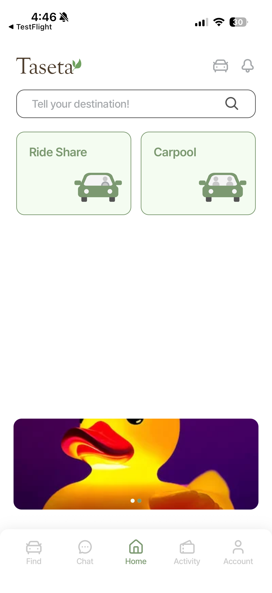 |  | 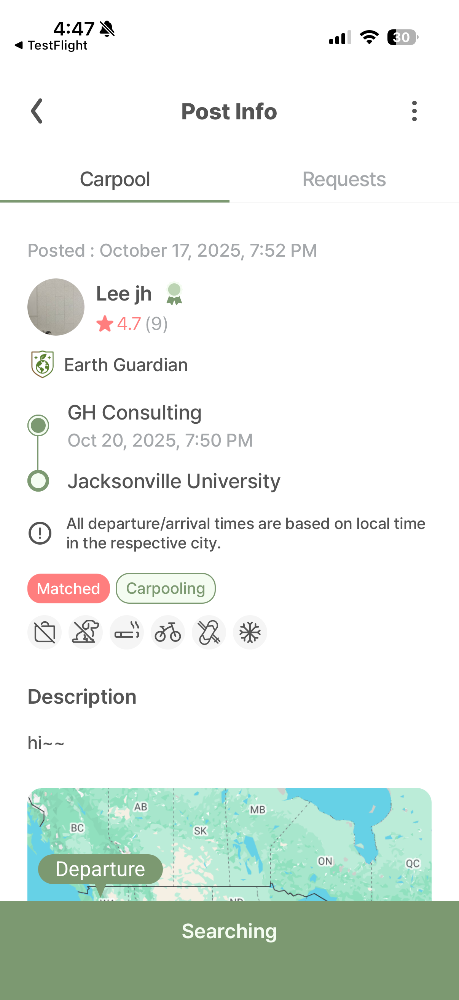 | 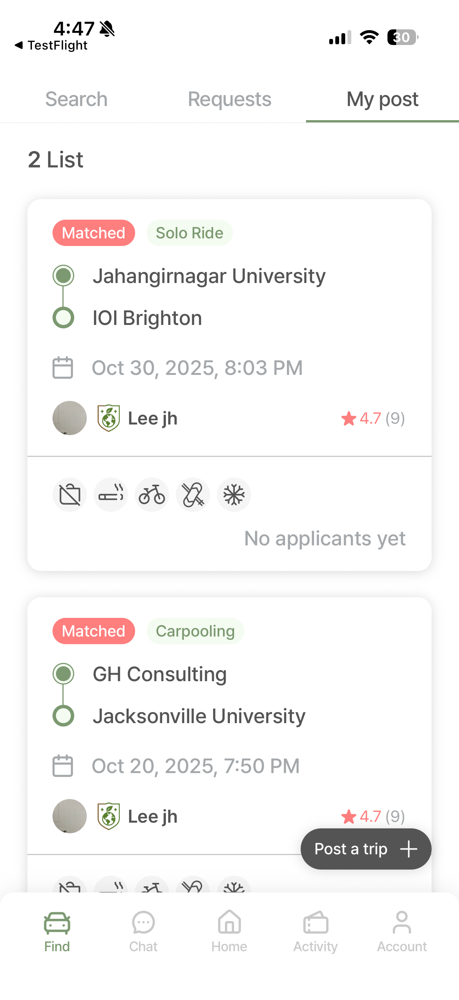 | 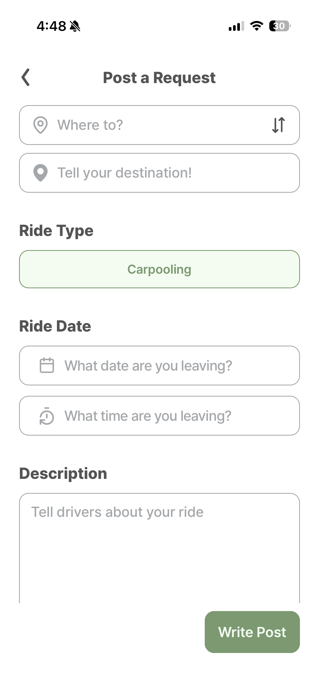 |

| 장소 검색 | 요청 작성 | 마이페이지 | 뱃지 시스템 | 탄소 절감 |
|:---:|:---:|:---:|:---:|:---:|
| 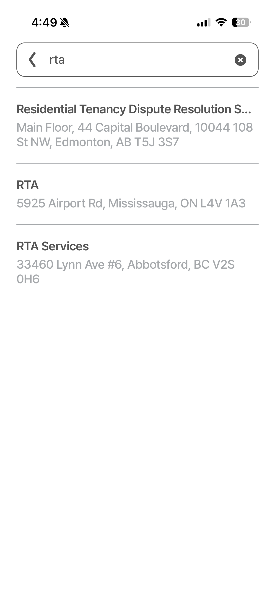 | 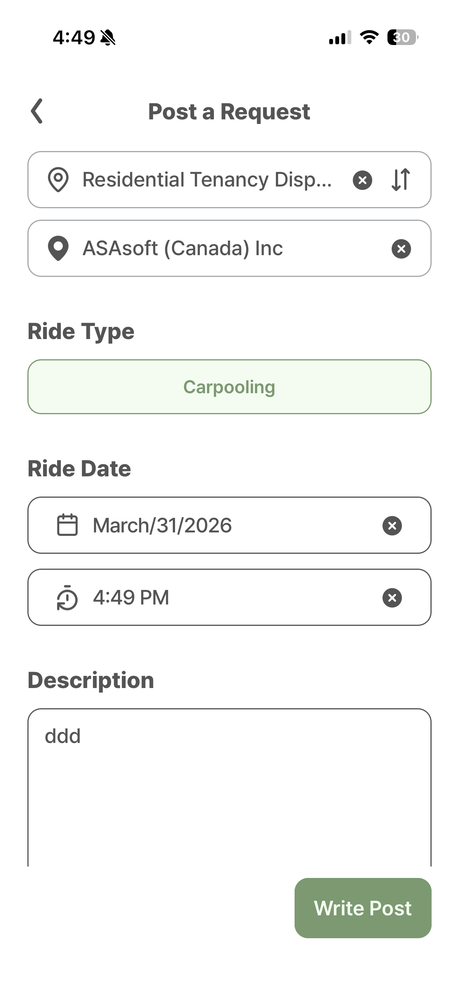 | 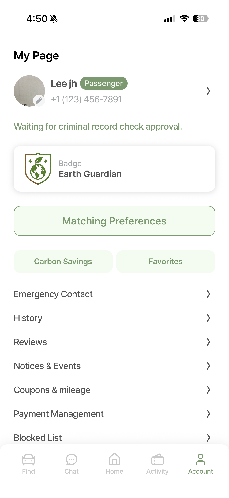 | 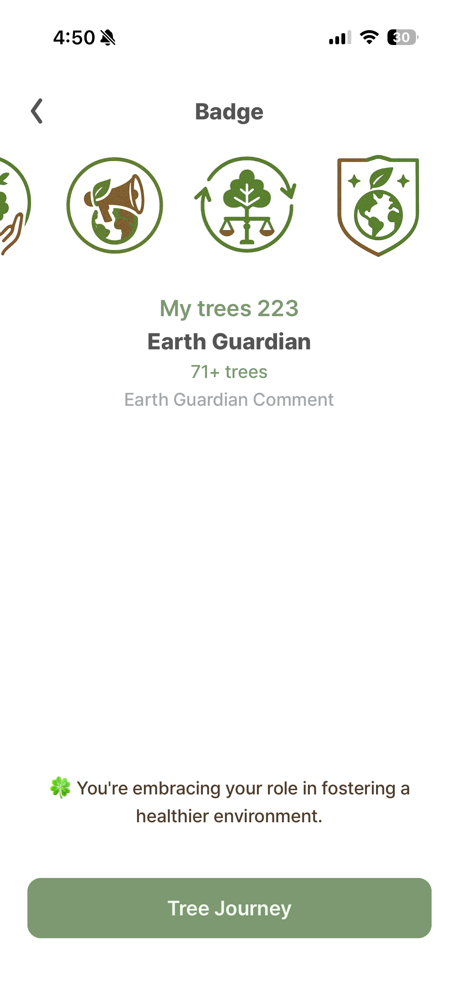 | 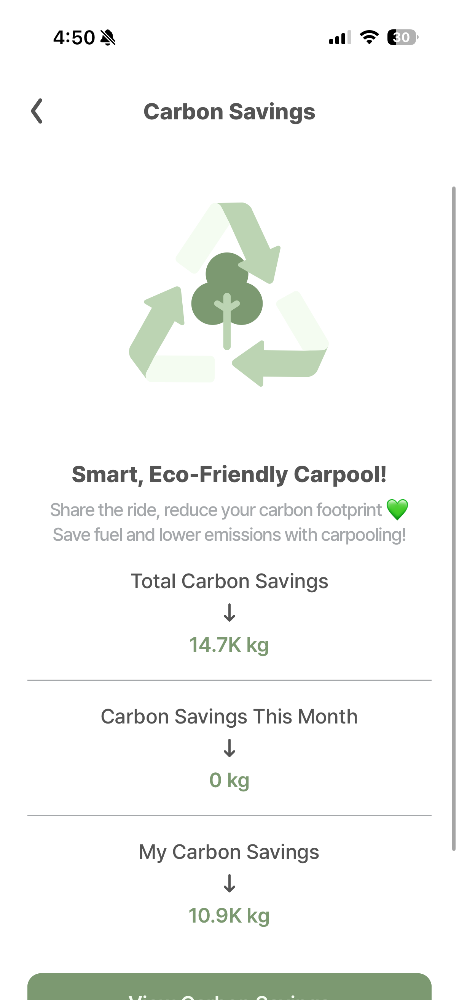 |

### 기사 앱
| 홈 | 요청 대기 | 경로 등록 | 요금 자동 계산 |
|:---:|:---:|:---:|:---:|
| 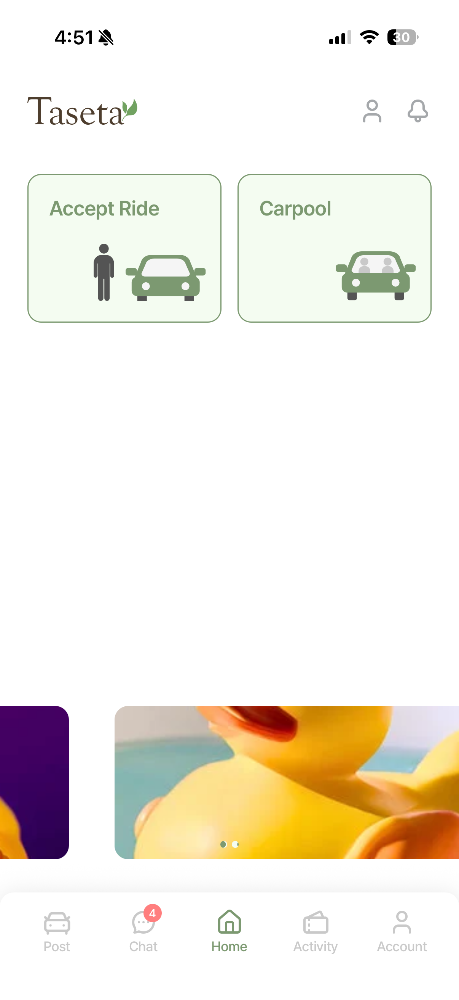 | 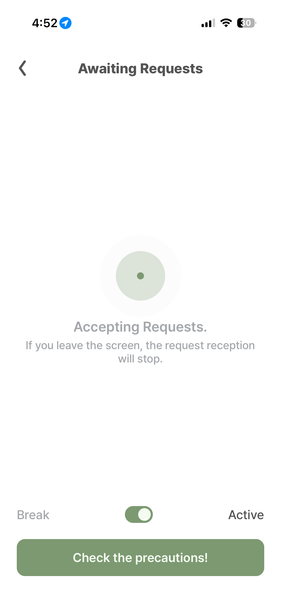 | 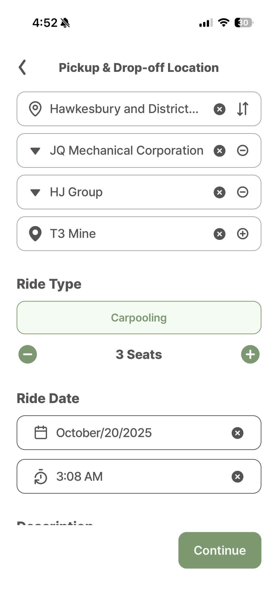 | 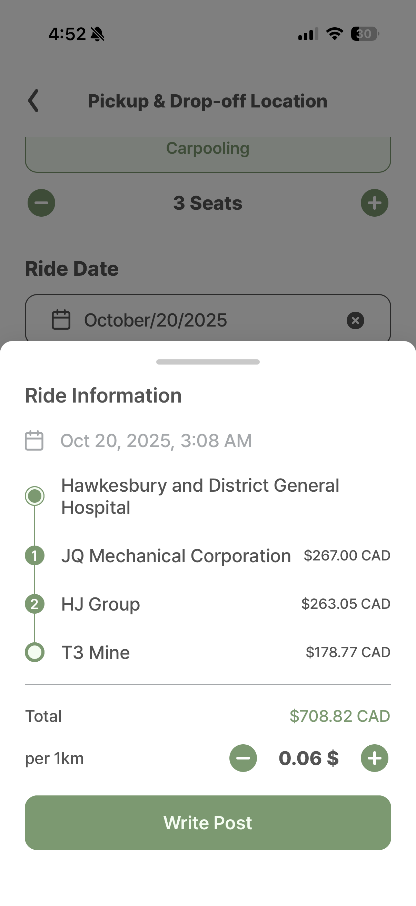 |

| 기사 신청 내역 | 운행 이력 | 정산 상세 | 운행 상세 & 리뷰 |
|:---:|:---:|:---:|:---:|
| 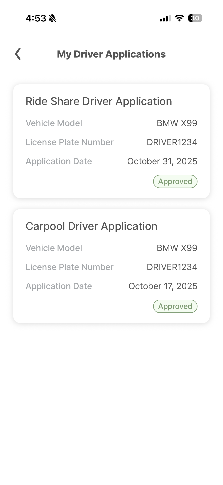 | 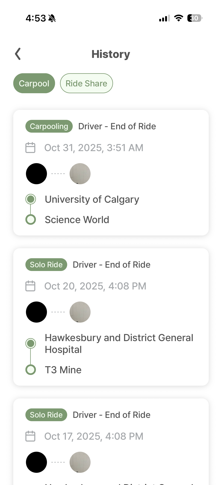 | 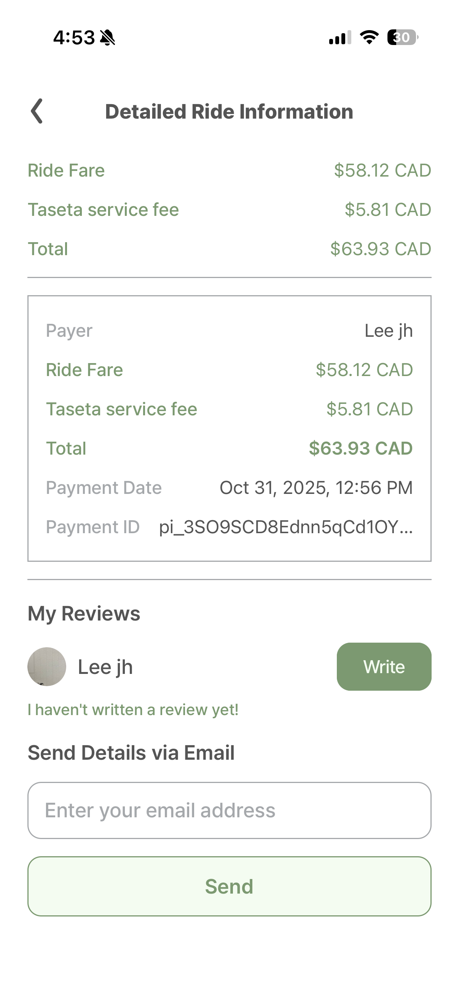 | 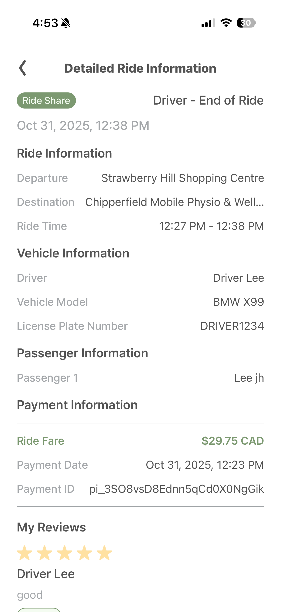 |

## 📱 프로젝트 개요

캐나다와 미국 지역에서 장거리 이동을 하는 사용자들을 위한 카풀 매칭 플랫폼입니다. 승객과 기사를 실시간으로 매칭하고, 안전한 카풀 서비스를 제공합니다.
카풀과 더불어 라이드셰어(UBER)기능도 제공합니다.

## 🛠 기술 스택

### Frontend
- **Framework:** React Native 0.81, Expo 54
- **State Management:** Zustand
- **Location:** Expo Location, Expo Task Manager (백그라운드 위치 추적)
- **Navigation:** Expo Router
- **Authentication:** Firebase Auth, 소셜 로그인 (Google, Apple)
- **UI/UX:** React Native Reanimated, Gesture Handler, Lottie

### Backend (비공개)
- **Runtime:** Node.js
- **Real-time:** Socket.io
- **Payment:** Stripe Connect (정산 시스템)
- **Authentication:** JWT, Firebase Auth

### 주요 라이브러리 (공통)
```json
{
  "expo-location": "~19.0.7",                   // GPS 위치 추적
  "expo-task-manager": "~14.0.8",              // 백그라운드 작업
  "@react-native-firebase/messaging": "^23",    // FCM 푸시 알림
  "@react-native-google-signin/google-signin": "^16", // Google 로그인
  "expo-apple-authentication": "~8.0",          // Apple 로그인
  "socket.io-client": "^4.8.1",                // 실시간 채팅
  "react-native-webview": "13.15.0",           // 지도 표시 (WebView)
  "react-native-gifted-charts": "^1.4",        // 차트 시각화
  "react-native-element-dropdown": "^2.12.4",  // 드롭다운
  "react-native-calendars": "^1.1313.0",       // 캘린더 (승객APP 전용)
  "zustand": "^5.0.8"                          // 전역 상태 관리
}
```

### 승객 앱 전용 라이브러리
```json
{
  "@stripe/stripe-react-native": "0.50.3"      // Stripe 결제
}
```

## ✨ 주요 기능

### 승객 앱 (승객APP)

#### 1. 카풀 검색
- **경로 검색:** 출발지/목적지 기반 카풀 검색
- **필터링:** 출발 시간, 가격, 차량 타입 등 필터
- **즐겨찾기:** 자주 사용하는 경로 저장
- **실시간 업데이트:** FCM 푸시 알림을 통한 새로운 카풀 등록 알림

#### 2. 라이드셰어 호출
- **경로 검색:** 출발지/목적지 기반 라이드셰어 검색
- **실시간 호출:** 라이드셰어 호출시 대기중이던 기사(기사앱)가 수락하여 호출위치로 이동(국내 택시와 비슷)

#### 3. 예약 & 결제
- **좌석 예약:** 원하는 좌석 선택 및 예약
- **실시간 채팅:** Socket.io 기반 기사와 1:1 채팅
- **결제 시스템:** Stripe를 이용한 카드 등록 및 자동 결제
- **쿠폰 & 할인:** 프로모션 쿠폰 사용

#### 4. 실시간 추적
- **위치 공유:** Expo Location을 이용한 실시간 차량 위치 확인
- **경로 표시:** GoogleMap 기반 예상 경로 표시
- **도착 예정 시간:** 실시간 ETA 계산
- **긴급 연락:** 비상 상황 신고 기능

#### 5. 리뷰 & 평가
- **기사 평가:** 탑승 후 기사 리뷰 작성
- **평점 시스템:** 5점 척도 평가
- **안전 신고:** 부적절한 행동 신고

### 기사 앱 (기사APP)

#### 1. 라이드셰어
- **모드 전환:** 호출 가능한상태, 휴식모드 전환
- **실시간 수신:** 호출 위치로부터 가까운 기사에게 Socket.io기반 콜 전송
- **자동 결제:** 운행완료시 승객의 등록된 카드로 자동결제 및 기사에게 정산
- 
#### 2. 카풀 등록
- **경로 등록:** 출발지/목적지/경유지 설정
- **좌석 관리:** 이용 가능한 좌석 수 설정
- **가격 설정:** 승객당 요금 설정
- **스케줄:** 출발 날짜 및 시간 설정

#### 3. 승객 관리
- **예약 현황:** 실시간 예약 승인/거절
- **승객 정보:** 승객 프로필 및 평점 확인
- **채팅:** Socket.io 기반 승객과 실시간 소통
- **알림:** FCM을 통한 새로운 예약 요청 푸시 알림

#### 4. 운행 관리
- **실시간 내비게이션:** GoogleMap 기반 경로안내 및 도로 트래픽 확인
- **경유지 추가:** 중간 픽업 포인트 설정
- **운행 시작/종료:** 탑승 확인 및 하차 처리
- **위치 공유:** Expo Task Manager를 이용한 백그라운드 위치 전송

#### 5. 정산 & 수익
- **수익 관리:** React Native Gifted Charts를 이용한 카풀별 수익 확인
- **출금 요청:** 정산금 출금 신청
- **거래 내역:** 월별/연도별 거래 이력
- **세금 정보:** 수익 신고용 자료 제공

### 공통 기능

#### 1. 회원 관리
- **회원가입:** Google/Apple 소셜 로그인
- **프로필 관리:** 프로필 사진
- **본인 인증:** expo-camera를 이용한 신분증/운전면허증 인증
- **등급 시스템:** 이용 실적에 따른 등급 부여

#### 2. 안전 기능
- **신원 확인:** 기사 신원 인증 필수
- **보험 연동:** 차량 보험 등록 확인
- **범죄이력조회 연동:** 북미지역 범죄이력조회(background)를 통한 범죄자 원천차단
- **긴급 연락:** SOS 버튼
- **이동 이력:** 모든 카풀 기록 저장

#### 3. 커뮤니티
- **공지사항:** 앱 업데이트 및 이벤트 공지
- **FAQ:** 자주 묻는 질문
- **고객센터:** 1:1 문의 및 신고

#### 4. 설정
- **알림 설정:** 푸시 알림 ON/OFF
- **언어 설정:** 영어/프랑스어 지원
- **결제 수단:** 카드 등록 및 관리 (승객APP)
- **차단 목록:** 특정 사용자 차단

## 📁 프로젝트 구조

```
├── 승객APP/                # 승객용 앱
│   ├── app/
│   │   ├── (tabs)/        # 메인 탭 (홈, 검색, 활동, 채팅, 마이)
│   │   ├── post/          # 카풀 게시글 관련
│   │   ├── call/          # 실시간 호출 관련
│   │   ├── chat/          # 채팅 기능
│   │   ├── payment/       # 결제 관련
│   │   └── my/            # 마이페이지
│   └── components/        # 공통 컴포넌트
│
└── 기사APP/                # 기사용 앱
    ├── app/
    │   ├── (tabs)/        # 메인 탭
    │   ├── post/          # 카풀 등록/관리
    │   ├── joinDriver/    # 기사 등록
    │   ├── verification/  # 인증 관련
    │   └── my/            # 마이페이지
    └── components/        # 공통 컴포넌트
```

## 🎯 주요 기술적 도전

1. **백그라운드 GPS 위치 추적:** Expo Location + Task Manager를 활용하여 앱이 백그라운드 상태에서도 기사의 실시간 위치를 지속적으로 전송하는 시스템 구현
2. **승객/기사 분리 아키텍처:** 동일한 백엔드를 공유하면서도 역할에 따라 완전히 다른 UX를 제공하는 2개의 독립된 앱 설계
3. **Stripe 결제 및 정산 시스템:** 승객 결제 → 플랫폼 수수료 차감 → 기사 정산까지의 전체 결제 플로우 구현
4. **WebView 기반 지도:** Google Maps SDK의 네이티브 의존성 복잡도를 줄이기 위해 WebView 기반 경량 지도를 선택, 경로 표시와 실시간 위치 업데이트를 구현
5. **실시간 ETA 계산:** 기사 위치 데이터를 기반으로 승객에게 도착 예정 시간을 실시간으로 업데이트

> **서버 소스**는 보안상 비공개입니다. 필요시 요청해 주세요.

